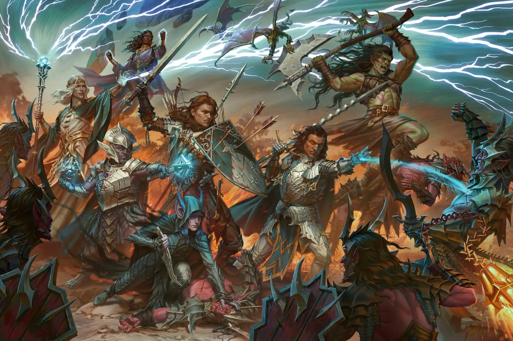

# Draw Steel!

> The Draw Steel system for Foundry Virtual Tabletop is used under license of  MCDM Productions, LLC. DRAW STEEL is © 2026 MCDM Productions, LLC.  This product is not subject to the DRAW STEEL Creator license and permission of use from this license do not apply.

This system is constantly improving and under active development. Feature requests can be made in the [issues](https://github.com/MetaMorphic-Digital/draw-steel/issues) tab.

## Installation Instructions

The latest version of the system can be installed through the in-app System Browser and searching for "Draw Steel".

You can also use one of the following alternative installation methods:
1. Pasting `https://github.com/MetaMorphic-Digital/draw-steel/releases/latest/download/system.json` into the **Install System** dialog on the Setup menu of the application.
2. Browsing the repository's [Releases](https://github.com/MetaMorphic-Digital/draw-steel/releases) page, where you can copy any system.json link for use in the Install System dialog.
3. Downloading one of the .zip archives from the Releases page and extracting it into your foundry Data folder, under `Data/systems/draw-steel`.

## Frequently Asked Questions

The [Wiki](https://github.com/MetaMorphic-Digital/draw-steel/wiki) is the best place to find out information about the system's features.

## Premium Content

The following modules have been produced by MetaMorphic Digital for Draw Steel games.
- [Road to Broadhurst](https://foundryvtt.com/packages/draw-steel-road-to-broadhurst)
- [Draw Steel: Heroes](https://www.foundryvtt.store/products/draw-steel-heroes)
- [Draw Steel: Monsters](https://www.foundryvtt.store/products/draw-steel-monsters)
- [The Delian Tomb](https://www.foundryvtt.store/products/draw-steel-delian-tomb)

## System Discussion

We have two dedicated channels in appropriate discord forums:
- In the [MCDM Discord](https://mcdm.gg/discord) look inside the ds_creations forum. The MCDM discord server is also the best place to ask about playing Draw Steel as a TTRPG.
- In the [Foundry Discord](https://discord.gg/foundryvtt) look inside the other-game-systems forum. The Foundry VTT discord server is also the best place to ask about using the Foundry VTT software.

## Community Contribution

If you wish to contribute to development, please review [CONTRIBUTING.md](./CONTRIBUTING.md).

## AI Policy

The Draw Steel system does not make use of AI (generative or otherwise) for any area of its implementation, be that art, code, or other. We expect all contributors to follow this same policy when contributing with a pull request; contributions made using AI will be rejected outright.
